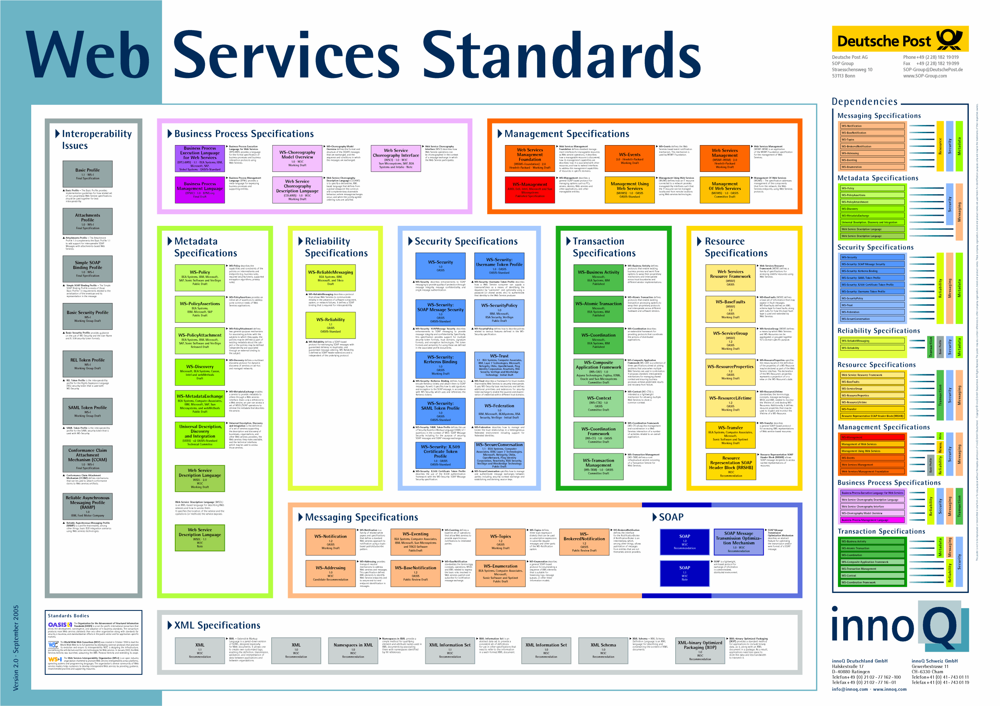

RESTful Webservices in .net 
===========================

!

## Why would I want web services in the first place?

!

 - Easiest way to allow others to make use of your application pragmatically
 - Generally pretty fast to develop, although it can well be a black hole
 - Can be used to expose data for integration between applications and is much better than integrating at the database

!

## What is a RESTful web service?

!

 - Introduced by Roy Fielding in 2000
 - Strongly influenced by CRUD

!

 - How does it differ from RPC style services?
 	- Typified by resources rather than verbs
 	- Accessed using HTTP verbs
 	- Stateless
 	- Cacheable (for some verbs)
 	- Layers so that the end system doesn't know if it is talking to an intermediary 

!

Also a bit simpler than WS-*

!

</img>

!

 - What is a resource?

!

 - Simon's REST maturity model
   - JSON over http
   - Supports verbs
   - Supports navigation through hyperlinks

!

## Payload

!

 - Usually JSON but it isn't required, CSV and even XML are permissible
 - The resulting format of the operation is typically described in the Accept headers

!

## REST on .net

There are a whole bunch of ways to do REST in .net

!

## REST on .net

- WebAPI
- OData (REST+)
- Service Stack

!

## Let's go write some code

!

## Beyond REST

!

 - There are an increasing number of situation where REST services are not applicable
 - Consider real-time processing requirements. Typically a socket is better for these.
 - Reliable communication is generally difficult over REST and something different is needed